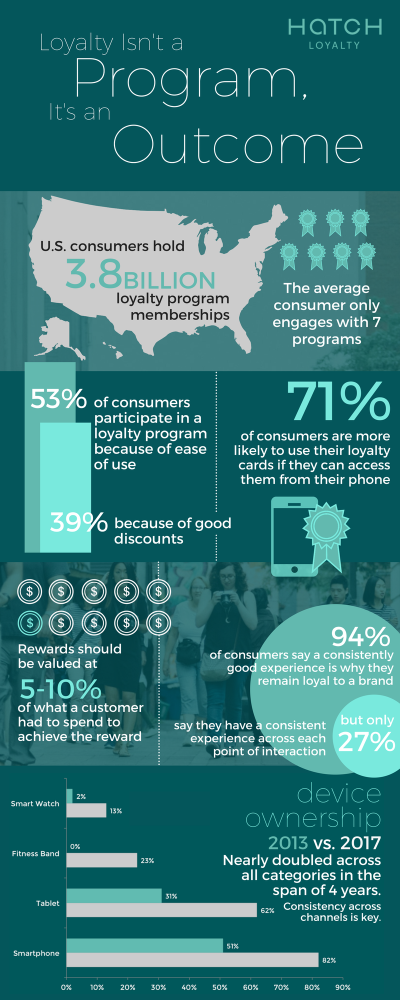

## When it comes to customer engagement programs, simplicity, adaptability, and profitability don’t have to be mutually exclusive.

In 2018, we will see more brands and retailers shift from creating a “loyalty program” to establishing a customer engagement strategy, folding a loyalty program as a component into their larger marketing scheme. While there are billions of loyalty program memberships in the U.S., many consumers aren’t engaged with more than a handful. Ease of use is a major factor when it comes to engagement. [Fifty-seven percent of consumers](http://www.businesswire.com/news/home/20170629005694/en/U.S.-Customer-Loyalty-Program-Memberships-Reach-Double/?feedref=JjAwJuNHiystnCoBq_hl-fLcmYSZsqlD_XPbplM8Ta6D8R-QU5o2AvY8bhI9uvWSD8DYIYv4TIC1g1u0AKcacnnViVjtb72bOP4-4nHK5iej_DoWrIhfD31cAxcB60aE) will abandon a loyalty program if it takes too long to earn a reward.

While rewards should be enticing enough to keep customers coming back, they must still be a profit center, not a cost center. Understanding purchasing patterns is one of the best ways to determine rewards and offers that are beneficial for both parties. [Over 55% of mobile marketing dollars](https://marketingland.com/study-55-percent-mobile-dollars-wasted-201408) are wasted, with more than 70% failing to create a positive user experience. The data gathered through a loyalty program helps to ensure marketing dollars are spent in the right places, and increases overall lifetime value of a customer.

Customers understand that their data is valuable, therefore, loyalty programs that have blanket, general rewards such as “Buy 10, Get 1 Free,” aren’t enough to keep customers engaged. Rapid shifts in consumer preferences have forced brands and retailers to intertwine loyalty programs with their overall marketing strategy, rather than running it in parallel. [Approximately 47% of consumers](https://cmocouncil.org/authority-leadership/reports/329) will abandon a brand if it repeatedly provides poor, impersonal, or frustrated customer experiences, so it’s important for brands to understand who their customers are on an individual basis.

What does this all mean? Retailers and brands must adapt or risk irrelevance. First, understanding that loyalty cannot be implemented in the form of a program, but must be cultivated over time is key. Second, embracing more flexible technologies that enable configurability and attribution will be the only way to keep up with changing demands.

[Read more about how Hatch](https://www.hatchloyalty.com/) empowers retailers and brands to develop simple, adaptable customer engagement programs that are also profitable for their business.

