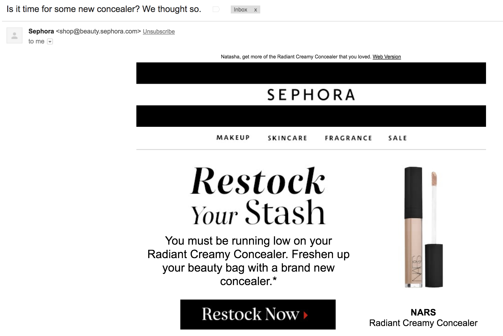
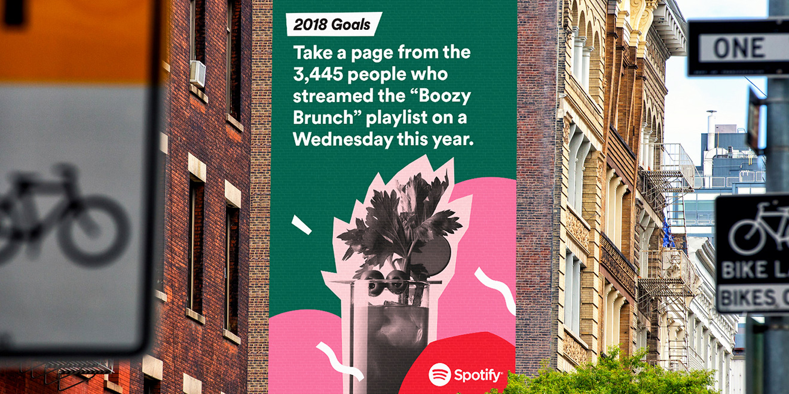

Personalization is **the** marketing buzzword of the moment. In a hyper-connected world where the average consumer is blasted with up to [10,000 brand messages](https://www.ama.org/partners/content/Pages/why-customers-attention-scarcest-resources-2017.aspx) per day, personalization becomes a strategic way for brands to break through the clutter. The demand is there as well, with [74% of consumers](https://www.marketingmag.com.au/hubs-c/customers-frustrated-irrelevant-marketing-messages/) saying they become frustrated when they’re targeted with irrelevant offers and marketing messages. Luckily, advancements in technology and access to increased amounts of customer data have enabled brands to deliver more targeted messages.

Brands like Sephora use data from past purchase behavior to inform dynamic emails. For example, they’re able to take the average amount of time between specific product purchases and prompt customers to repurchase that product before they run out. This shows customers they’re listening by delivering a convenient reminder, and also boosts their bottom line by getting customers to restock from their store versus other retailers.

Other brands like Spotify have taken data to comical lengths. At the end of 2017, they launched a campaign that mined user data for fun, silly habits and transformed them into billboards with the theme [‘2018 Goals.’](http://www.adweek.com/creativity/spotify-unearths-more-hilarious-user-habits-in-global-outdoor-ads-for-the-holidays/)

These are just two examples of how brands are diving deep into customer data for marketing and customer engagement initiatives.

## But are brands getting *too* personal?

[Target](http://www.slate.com/blogs/how_not_to_be_wrong/2014/06/09/big_data_what_s_even_creepier_than_target_guessing_that_you_re_pregnant.html) was able to determine that a teen in Minnesota was pregnant based on her purchase behavior before she was able to communicate the news to her family. Rather than viewed as personalization, this was seen as intrusive. Target isn’t the only retailer to toe the line between engaging and creepy.

Think of the last time you searched for something on Amazon. Now think of how many times you saw an ad for that same item across channels and devices. Many retailers are able to identify a single customer across the various devices they use, which allows for better targeting for the retailer, but may feel intrusive for the customer.

As the amount of data brands and retailers have access to increases exponentially, they will have to be strategic about how they’re using that data. A customer who is part of a loyalty and engagement program is willingly sharing their data with so that they receive more personalized communication. However, those expectations can differ from the rest of the customer population as privacy concerns continue to be on the rise. At the end of the day, the [customer must come first](https://www.hatchloyalty.com/blog/from-personas-to-personalization-people-based-marketing/).

Utilizing personal and behavioral data to anticipate future behavior has become the golden standard for marketers. However, if leveraging that data only benefits the brand or retailer’s bottom line without delivering much value to their customer, or without the customer opting in to share that data, it’s more likely to result in misuse of customer data.

Consider the Target example again. The baby care industry is worth more than $30 billion, so naturally a retailer like Target would want to be the family’s retailer of choice as early as possible. By analyzing past customer data, Target was able to identify [25 products](http://www.nytimes.com/2012/02/19/magazine/shopping-habits.html?_r=1&hp=&pagewanted=all) women buy when they are entering into their second trimester with nearly 87% accuracy. The case is still up for debate, but if Target is able to deliver value most of the time with offers and baby-specific content for soon-to-be mothers, does that justify fringe cases such as with the Minnesota teen?

There is no cut and dry formula for delivering personalized messaging without crossing the line to intrusiveness, but make sure customers are expecting these messages and have opted in. Brands and retailers can start by asking themselves the following questions:

* _Who is the audience?_
* _Does this deliver value to the customer?_
* _Will this enhance their overall customer experience?_
* _Has the customer voluntarily shared this data?_

Answering these questions with the customer top of mind should guide personalization decisions and shield brands from most of the potentially “creepy” backlash.
