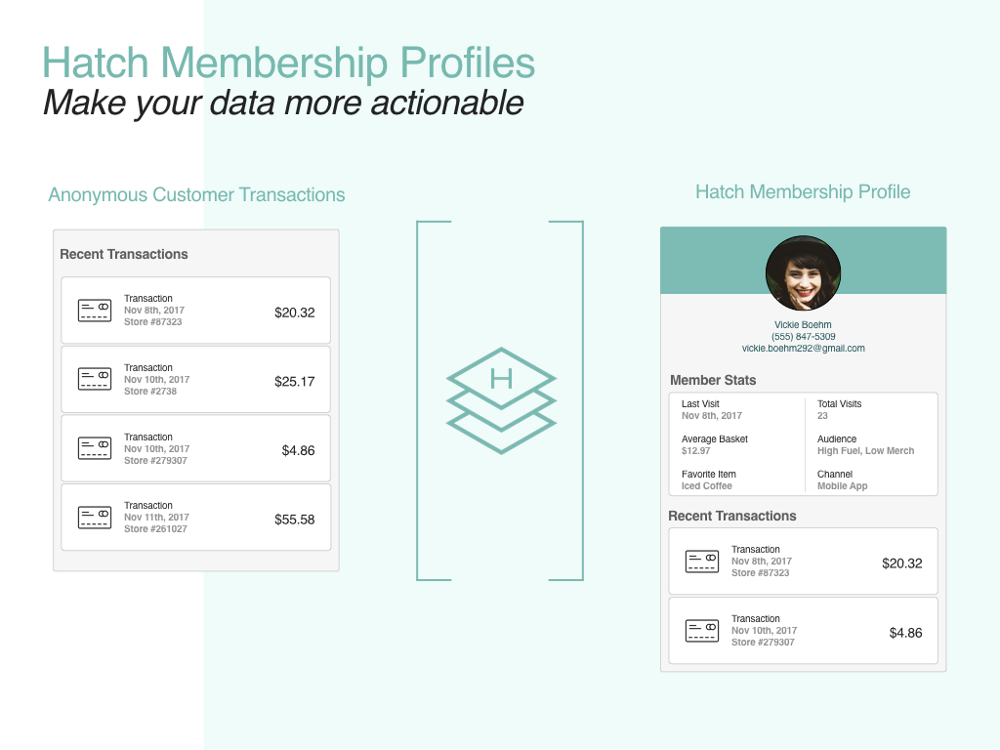
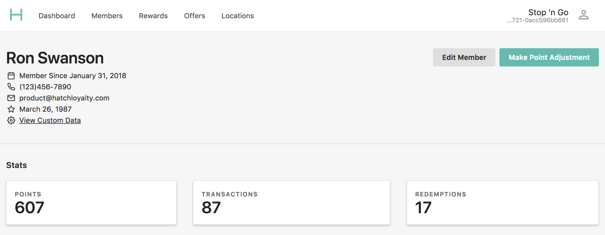
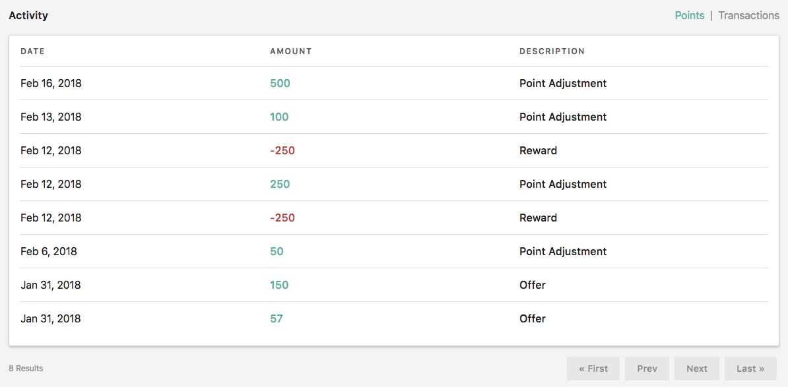
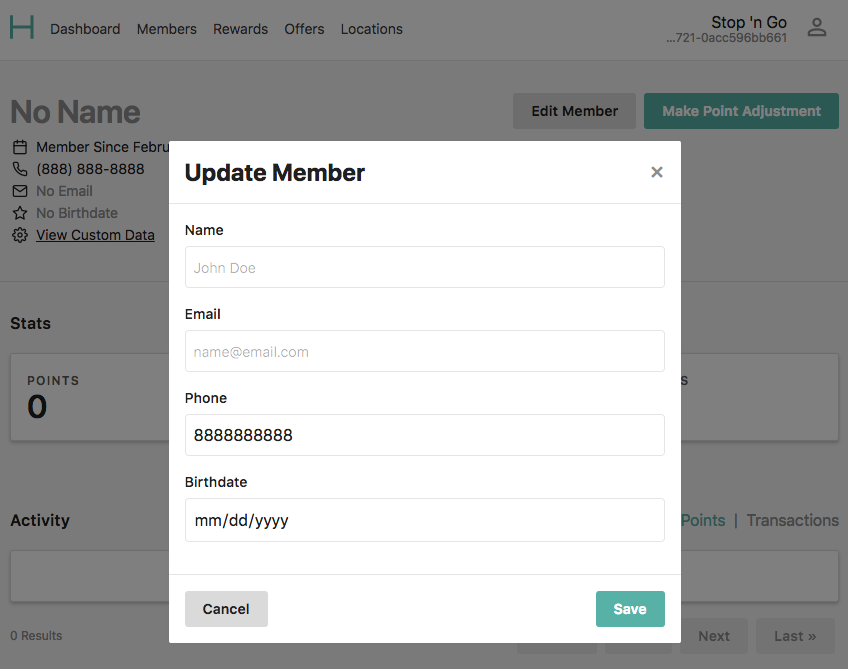
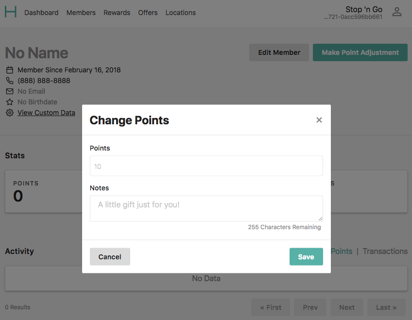

At Hatch, we believe successful loyalty and engagement programs start with the
customer. Knowing how they engage with your brand is key to building more
personalized experiences. Thankfully, Hatch has developed a platform that's
specifically designed to help companies build better, more personalized
relationships with their customers. Here's how it works:

## Turn Customers into Members

Unlocking personalization starts by turning anonymous customers into unique
memberships in the Hatch platform. A **membership** is the term Hatch uses to
describe an individual person participating in a loyalty program.

There are a few different ways to create memberships in the Hatch platform,
however, most of our customers choose to enroll new members by leveraging our API's
in their mobile apps and POS flows. If you're interested in a more detailed
explanation of how to manage memberships via API, please visit the [Hatch Developer Hub.](https://developer.hatchloyalty.com/tutorials/member-enrollment/)

Once someone becomes a member, the Hatch platform can begin associating
their behavior to relevant data such as transactions, points earned, offers
fulfilled, rewards redeemed, and more. All of this information is used to create
robust profiles for each member in the program, which is then made available through
Hatch HQ, our program management product.

## Understand Your Members

As you can see, what starts out as a simple, anonymous customer, very quickly
becomes a detailed membership profile filled with rich, actionable data such as:

- relevant membership information (e.g. name, birthday, email, phone number, etc.)
- current point total
- total transactions
- total rewards redeemed
- total offers fulfilled
- externally supplied custom data

Additionally, Hatch keeps a detailed account of each member's activity with
the program and displays that data in each profile's activity feed. This feed
helps customer service reps and marketing managers answer questions like:

  - Why did this member earn 100 points?
  - Which customer support user added 200 points to an account and why?
  - What line items were included in a specific transaction?
  - Why didn't I receive points for this product?

We believe that real time access to member specific data is a key
component of any successful loyalty and customer engagement program.

Over time, this data will lead to more informed marketing strategies because
you'll know exactly which types of offers and rewards will drive
engagement for each specific member in your program.

Ultimately, our goal with the membership profile manager is to provide a way
for our customers to understand how each individual membership is engaging
with their program, so they can craft smarter, more personalized loyalty and
customer engagement programs.

## Manage Your Members

We understand that sometimes things don't go as expected. For example, let's say
a member signed up using the wrong email address. You can log into HQ and easily
update the details of any membership in the program.

Here's another example. Let's say one of your Members had a poor experience
at one of your locations. Simply log into HQ and add some points to the members
profile to prevent further damage. There's nothing worse than an upset customer.

While Hatch is not designed replace your customer support tool, we do want to make sure
you have a basic set of tools to help manage customer expectations, understand
how members are engaging with the program, and triage common support related issues.

## Next Up

- Building a more unified and detailed member activity feed
- Adding more relevant data points to membership offer & reward cards
- Enhancing our membership engagement statistics
