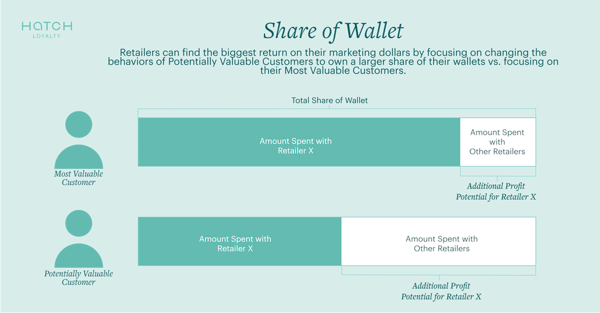

Retailers make 80% of their profits from 20% of their customers. Everyone has heard this golden rule of sales. What if they could increase the 80%? Or the 20%? The impact on their bottom line could be exponential.

The very top customers of that 20% are a retailer’s Most Valuable Customers (MVC’s). But they aren’t who retailers’ efforts should be focusing most of their marketing dollars on. Retailers may actually see a greater impact by focusing on the Potentially Valuable Customer (PVC).

That sounds counterintuitive, doesn’t it?

Let’s illustrate an example. Jerry always goes to Gas & Shop for his fuel and any snacks or drinks he’s craving. He thinks they have the best fuel and service, and usually doesn’t stop at other gas stations unless he has no other choice. Jerry is one of Gas & Shop’s top customers in both fuel AND merchandise. Because Gas & Shop owns a greater share of Jerry’s wallet, there isn’t much room to increase his frequency or spend.

Therefore, investing marketing dollars on Jerry intended to increase the share of wallet owned by Gas & Shop would be poorly invested. If a customer is already choosing a certain retailer and is loyal, the goal should be to utilize the data the retailer owns on that customer to maintain that relationship. It’s not that retention investments shouldn’t be made at all, but in this case, the greatest potential for growing Gas & Shop’s bottom line comes elsewhere.

Consider another customer, Laura. She doesn’t really have a preference where she pumps her fuel and usually opts for the closest gas station. Sometimes she stops in for a Diet Coke when she’s craving one, but typically doesn’t buy any merchandise when she pumps fuel. Gas & Shop breaks even with Stop4Gas when it comes to Laura’s share of wallet.

Looking at the image below, there is greater potential to not only increase the total amount Laura spends by delivering merchandise offers, but there’s also potential to increase the amount she spends with Gas & Shop vs. Stop4Gas. Because there is greater potential profit to be made from Laura, the goal should be to convert her from a Potentially Valuable Customer (PVC) to a MVC.

If a retailer has the capability to collect and analyze customer data, it’s likely they would have a large amount of information about their MVCs. Their goal in that case is to maintain those customers at that status through personalized offers and exclusive perks generated by their customer engagement platform. The likelihood of increasing their total share of wallet is unlikely, so the retailer should instead take initiative to not lose any share of wallet to a competitor.

When it comes to PVC’s, retailers likely don’t have large or consistent amounts of data. The key here is to test a variety of offers and iterate on what works best as they continue to collect behavioral and transactional data. This allows a retailer to understand if a customer is responsive to offers and efforts to increase frequency and basket size, thus identifying PVC’s and the marketing messages that will alter their behavior. Having a flexible, adaptable customer engagement platform is an integral part of moving a PVC to MVC status.

## Why Retailers Should Focus on Growing Their MVC's vs. Acquisition Marketing

Most companies are more focused on customer acquisition than customer retention ([44% and 18% respectively](https://www.invespcro.com/blog/customer-acquisition-retention/)), even though it can cost anywhere from [5-25 times more to acquire a new customer](https://hbr.org/2014/10/the-value-of-keeping-the-right-customers) than it does to retain a customer. However, by focusing on driving new customers through the door, efforts are taken away from the real profit drivers, which are moving customers from new or infrequent through the funnel to a Most Valuable Customer status.

The disparity in cost between acquisition and retention becomes even more apparent when layering a loyalty and customer engagement platform over it. If the focus is to acquire new customers, as time goes on, there will be more infrequent and semi-frequent (read: not profitable) customers and less MVC’s. The return on investment decreases over time when a retailer focuses on acquisition instead of retention.

With a focus on customer engagement, retention and loyalty, a retailer can generate more MVC’s and frequent customers who will be the 80%+ of their profits. Funneling more customers into that group is, therefore, the strategy that drives a retailer’s bottom line.

Over time, a loyalty and customer engagement platform can move more customers into the more profitable segments by collecting more, and understanding behavioral and transactional data. While marketing should still be allocated to acquisition in order to fill the sales funnel, there is a strong argument for redistribution.

--

As counterintuitive as it sounds, focusing loyalty efforts on a retailer’s Most Valuable Customers results in their customer engagement platform becoming a cost center instead of a profit center. MVC’s are already choosing that retailer over others and spending larger amounts of money there, so regardless of what the retailer does, the needle won’t move much.

Customers who are frequent customers, but may be splitting their share of wallet between a couple of retailers, or have a smaller basket size, are where the greatest opportunity for profit is. The ability to convert them into a MVC is where a loyalty and engagement platform comes in and increases the ROI far more than if marketing funds were focused primarily on the top or bottom of the funnel.

[Learn more](https://www.hatchloyalty.com/) about how Hatch can help you convert more customers into your valuable customers.
