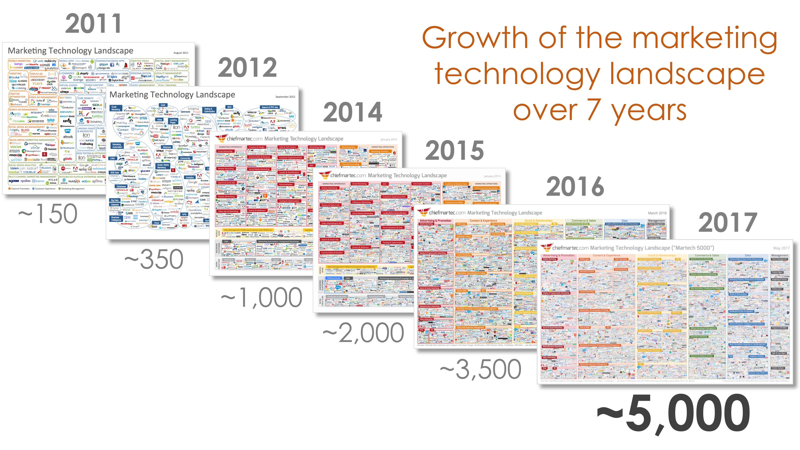
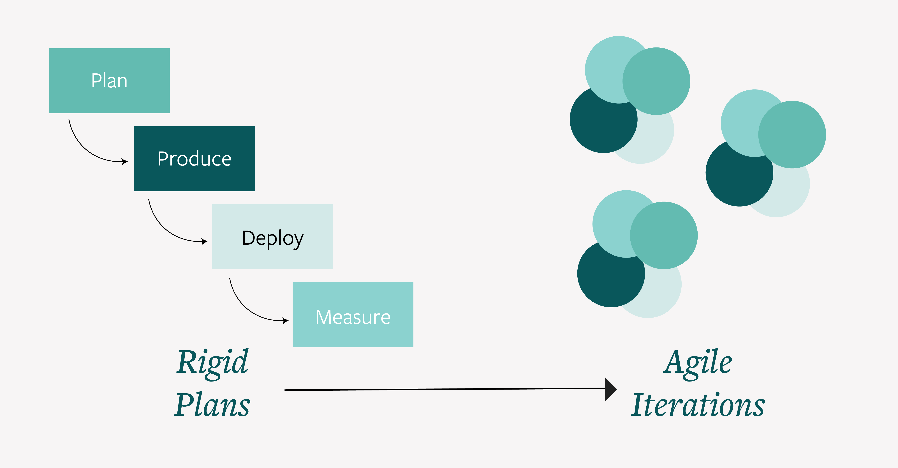
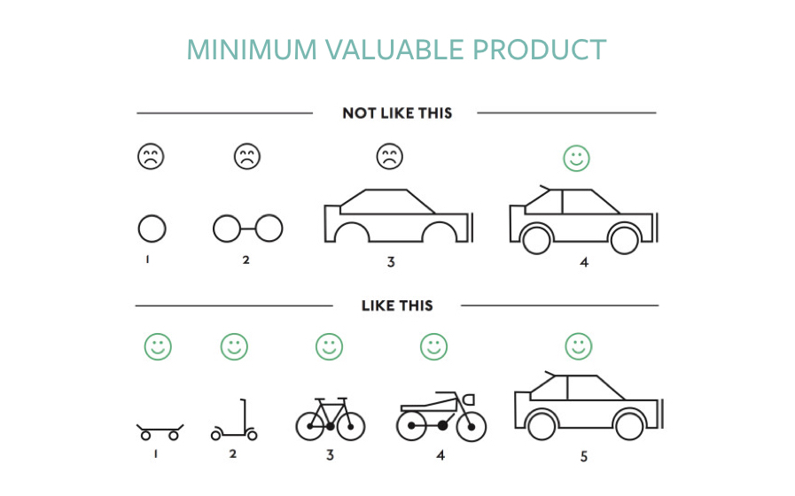

## The Digital Era is Changing How Organizations Work

As the IT era shifts into the digital era, solutions within martech are becoming unbundled and specialized.  According to [chiefmartec.com](http://chiefmartec.com/), in 2011, there were approximately 150 marketing technologies.  By the end of 2017, there were nearly 5,000 companies providing technology, and the trend does not appear to be slowing.

Why?  According to Scott Brinker, the editor of chiefmartec.com, “Marketing has become a technology powered discipline, and therefore marketing organizations must infuse technical capabilities into their DNA.”

The growth of martech solutions is a clear reflection of a changing mindset in modern organizations.  Organizations are focusing on technology as a core competence and it’s forcing them to change the way they work: from *__rigid plans__* to *__agile__* iterations.

The introduction of agile planning into modern organizations will have a large impact on legacy providers.  These providers generally produce very inflexible solutions, aligned toward rigid planning cycles, or limited flexibility (white-label tooling and customized solutions).

Brands and retailers can’t plan technology and engagement strategy two years in advance.  Why not find a partner who can adapt to your approach, and for whom agility is in their DNA?

## Hatch: Introducing an Agile Approach to Developing Modern Customer Engagement

Hatch was purpose-built for the digital era and the modern organization.  Legacy providers will ask you to predict whether you’ll need a boat, a plane or a car in the future. They’ll ask you to choose the make, model, color and features today; and should you choose to change or upgrade those features in the future, they will need to rebuild the car.  Hatch won’t.  And we won’t ask you to sacrifice or predict your future.

Hatch allows you to start with a skateboard, simple and fast to market so you can learn from the data your program collects. Whatever your business needs are, or will become, a platform is flexible and agile enough to meet those needs, without starting from scratch.

How are we so confident?  It starts with our product development mindset.  When we build products and plan for roadmap, a core set of questions drive our design and prioritization:

1. How does this product/feature drive flexible program design and easy program management?
2. How does it allow you to measure your program performance?
3. Is it designed for integration into your marketing stack?  Is it developer-friendly?
4. How does it provide secure and easy access to your customer data, and the consumer trends driving your business?

This approach sets us apart.  It is core to who we are.  We’ll always publish our APIs, we’ll provide SDKs, we’ll give you access to a sandbox,  and we’ll show you how simple, adaptable and profitable loyalty can be.

Organizations are changing they work, and suppliers of technology must follow suit.  Hatch is purpose-built for this shift, introducing speed, agility and scalability to your consumer engagement efforts.  If your provider can’t deliver a product to drive revenue in 3 months, you may have the wrong partner.
