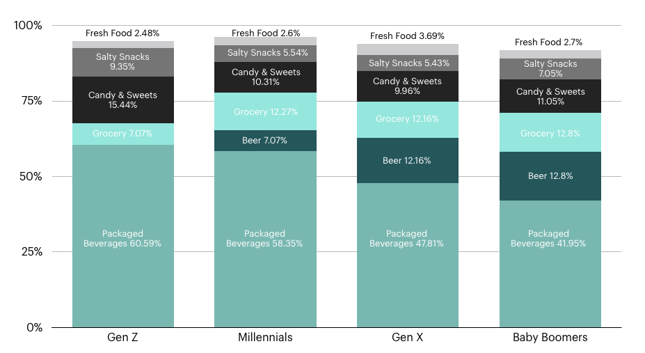
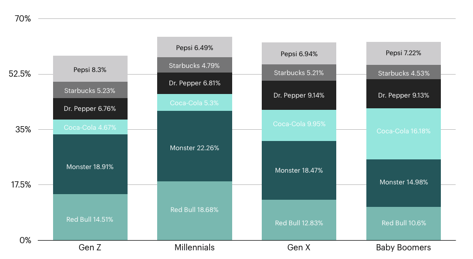

The convenience store industry has been riddled with renditions of the infamous [Bubba persona](https://www.technomic.com/newsletters/technomics-take/beyond-bubba-recalibrating-conventional-view-c-store-consumer), believed to embody the characteristics of the industry’s most frequent and valuable customer. For decades, convenience, fuel and shopper marketers alike have funnelled large amounts of marketing dollars into campaigns and offers rooted in the Bubba persona.

However, we’ve seen the retail industry change drastically over recent years as technology and consumer expectations have evolved, and the [convenience industry is not exempt](https://www.hatchloyalty.com/blog/whats-next-for-convenience-retail/) from this shift. The rise of ecommerce and electric cars are additional contributing factors to a changing industry.

To begin, who is Bubba? Demographically, he is a male in his mid-30s and a blue collar worker residing in a rural area. He likes to purchase fuel, “cokes & smokes,” Bud Light, coffee and hot dogs. For a what was a widely used portrait of the convenience store customer, the scope is quite narrow when considering who today’s c-store shopper is.

This is not to say the Bubba persona is no longer relevant (tobacco still accounts for [38% of all sales](https://www.nielsen.com/us/en/insights/news/2017/how-us-convenience-stores-can-stay-ahead-of-the-retail-pack.html)), but there is much more diversity and depth to today’s c-store customer. It is because of that diversity that the model of marketing to a persona and/or segment must be flipped on its head.

## Who Shops in C-Stores Today?

**The Generational Shift**

Someone in their mid-30s (akin to the Bubba persona) is on the older range of the millennial generation, which is the age group that currently holds the most purchasing power in the US. However, by 2020, Gen Z (born in the mid-90s) will account for [40% of all shoppers](https://www.hatchloyalty.com/blog/decoding-gen-z-diverse-generation-impact-brand-loyalty/).

While traditional retail seen a steep decline in sales due to these digital native generations, convenience retail is an exception. However, both millennials and [Gen Z](https://csnews.com/generation-z-shows-preference-around-corner-retail) still have a preference for experiences that are seamless and convenient, which will force convenience retailers to re-evaluate and improve the customer experience.

**In the Land of Women**

While men still shop at c-stores more than women, that gap is narrowing. [Approximately 11% of women](https://csnews.com/three-distinguishing-characteristics-female-c-store-shoppers) shop at a convenience store “almost every day” compared to 14% of men. The Bubba persona just does not account for the female shopper on a variety of levels from both a demographic perspective as well as product preferences.

With less time on their hands than ever before, women are shopping at c-stores for last minute items rather than trekking to a grocery store. In turn, they’re looking for quick, seamless experiences and often shopping for things other than “Cokes & smokes.” [They value loyalty](https://csnews.com/three-distinguishing-characteristics-female-c-store-shoppers) and customer engagement programs that activate their data, to make their shopping experience more convenience and personalized.

**More Products, More Options**

Tobacco still accounts for nearly two thirds of in-store sales. However, this could soon shift as only 20% of millennials and Gen Z reported smoking in 2015 compared to 25% in 2010.

The key to customer engagement and driving a c-store’s bottom line, therefore, lies in other merchandise. The most purchased categories across generations include packaged beverages, beer, grocery, candy & sweets, salty snacks and fresh food.

The beverage and snack categories are dominant among non-tobacco sales. However, millennials are far less likely to purchase beer at a convenience retailer: a departure from the Bubba persona.

Additionally, purchases in the grocery category increase significantly among most generations, indicating that convenience retailers have become a destination for last minute grocery items for busy customers who don’t have the time to make the journey to a grocery store for just a few goods.

Fresh food (not *just* hot dogs) is one of the [fastest growing categories](http://www.cspdailynews.com/category-news/foodservice/articles/foodservice-sales-are-now-what), particularly among younger generations who value not only convenience, but also fresher, healthier food options on the go.

The packaged beverage category drives a large majority of non-tobacco sales. However, the “Cokes” part of Cokes & smokes may not be as relevant for today’s c-store customer when breaking down the beverage category.

Energy drinks are the beverage of choice across generations, but hold the most market share among Gen Z and millennials. Additionally, Coca-Cola is not as dominant among Gen Z and millennials in comparison to other soda brands, indicating that consumer preferences have become more diverse as more options have become available.

## The New C-Store Persona

Changes in consumer preferences and advances in technology beg the question: who is the new Bubba? The answer is quite simple: there is no longer a single c-store customer persona. Moreover, there aren’t even a handful of personas that could capture the nuances among customers.

Starting with a persona to build a marketing and customer activation strategy can leave a retailer blind to not only certain preferences, but to entire groups of customers. Any persona or segment should begin with customer data.

By rooting personas and segments in customers’ demographic, [behavioral](https://www.hatchloyalty.com/blog/hacking-the-habit-why-understanding-habit-formation-critical-retailers/) and transactional data, retailers can account for the fluctuations in customer preferences, life changes and all that happens in between.

Not only does the Bubba persona disregard a massive portion of today’s convenience retail customers, starting with a persona and working backwards is no longer a feasible strategy for retailers. With abundant access to customer data, retailers must find technologies that empower them to activate that data to build personas from the ground up.

Personas should be as nebulous and complex and humans and should not be set in stone. Instead, retailers must let their data tell the story.

[Learn more](https://www.hatchloyalty.com/c-store/) about how Hatch can help you harness your data to build personas.
